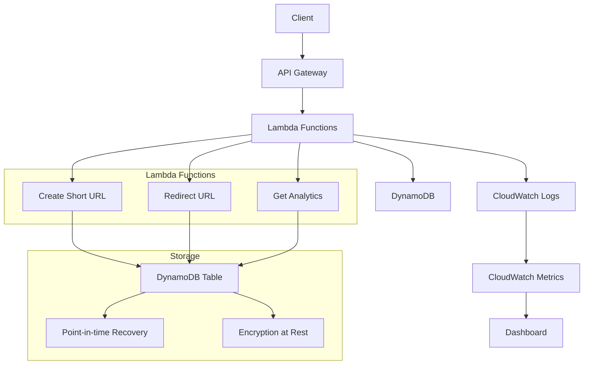

# AWS Serverless URL Shortener

A production-ready, scalable URL shortener built with AWS serverless technologies. This project demonstrates best practices for building serverless applications with comprehensive monitoring, security, and testing.

## 🚀 Features

- **High Performance**: Serverless architecture with automatic scaling
- **Analytics**: Track click counts and usage statistics
- **Security**: Input validation, rate limiting, and secure redirects
- **Monitoring**: CloudWatch logging, metrics, and dashboards
- **Testing**: Comprehensive unit and integration tests
- **CI/CD**: Automated deployment pipeline with GitHub Actions
- **Infrastructure as Code**: Terraform for infrastructure, SAM for application deployment

## 📋 Table of Contents

- [Architecture](#architecture)
- [API Endpoints](#api-endpoints)
- [Prerequisites](#prerequisites)
- [Quick Start](#quick-start)
- [Development](#development)
- [Testing](#testing)
- [Deployment](#deployment)
- [Monitoring](#monitoring)
- [Security](#security)
- [Contributing](#contributing)
- [License](#license)

## 🏗️ Architecture



### Components

- **API Gateway**: RESTful API with CORS support and request validation
- **Lambda Functions**: Three functions handling URL creation, redirection, and analytics
- **DynamoDB**: NoSQL database with point-in-time recovery and encryption
- **CloudWatch**: Logging, monitoring, and alerting
- **Terraform**: Infrastructure provisioning and management
- **AWS SAM**: Serverless application deployment

## 🔗 API Endpoints

### Create Short URL
```http
POST /shorten
Content-Type: application/json

{
  "url": "https://example.com/very/long/url"
}
```

**Response:**
```json
{
  "short_url": "https://api.example.com/abc123",
  "short_code": "abc123",
  "original_url": "https://example.com/very/long/url",
  "created_at": "2024-01-01T00:00:00Z"
}
```

### Redirect to Original URL
```http
GET /{shortCode}
```

**Response:** 301 Redirect to original URL

### Get Analytics
```http
GET /analytics/{shortCode}
```

**Response:**
```json
{
  "short_code": "abc123",
  "original_url": "https://example.com/very/long/url",
  "created_at": "2024-01-01T00:00:00Z",
  "click_count": 42,
  "is_active": true
}
```

## ✅ Prerequisites

- [AWS CLI](https://aws.amazon.com/cli/) configured with appropriate permissions
- [Terraform](https://www.terraform.io/) >= 1.0
- [AWS SAM CLI](https://docs.aws.amazon.com/serverless-application-model/latest/developerguide/install-sam-cli.html)
- [Python](https://www.python.org/) >= 3.11
- [Docker](https://www.docker.com/) (for SAM local testing)

## 🚀 Quick Start

### 1. Clone the Repository
```bash
git clone <repository-url>
cd aws-serverless-url-shortener
```

### 2. Install Dependencies
```bash
pip install -r requirements.txt
```

### 3. Deploy Infrastructure
```bash
cd terraform
terraform init
terraform plan -var="environment=dev"
terraform apply -var="environment=dev"
cd ..
```

### 4. Deploy Application
```bash
sam build
sam deploy --guided
```

### 5. Test the API
```bash
# Create a short URL
curl -X POST https://your-api-gateway-url/shorten \
  -H "Content-Type: application/json" \
  -d '{"url": "https://example.com"}'

# Test redirect
curl -I https://your-api-gateway-url/abc123

# Get analytics
curl https://your-api-gateway-url/analytics/abc123
```

## 🛠️ Development

### Project Structure
```
aws-serverless-url-shortener/
├── lambda/                    # Lambda function code
│   ├── create_short_url.py   # URL creation handler
│   ├── redirect_url.py       # URL redirection handler
│   └── get_analytics.py      # Analytics retrieval handler
├── terraform/                 # Infrastructure as Code
│   ├── main.tf               # Main Terraform configuration
│   ├── variables.tf          # Terraform variables
│   └── outputs.tf            # Terraform outputs
├── tests/                     # Test suite
│   ├── test_create_short_url.py
│   ├── test_redirect_url.py
│   └── test_get_analytics.py
├── .github/workflows/         # CI/CD pipeline
├── template.yaml              # SAM template
├── samconfig.toml            # SAM configuration
└── requirements.txt           # Python dependencies
```

### Local Development

1. **Set up environment:**
```bash
python -m venv venv
source venv/bin/activate  # On Windows: venv\Scripts\activate
pip install -r requirements.txt
```

2. **Run tests:**
```bash
pytest
```

3. **Run linting:**
```bash
flake8 lambda/ tests/
black --check lambda/ tests/
isort --check-only lambda/ tests/
mypy lambda/
```

4. **Local testing with SAM:**
```bash
sam local start-api
# Test endpoints at http://localhost:3000
```

## 🧪 Testing

### Running Tests
```bash
# Run all tests
pytest

# Run with coverage
pytest --cov=lambda --cov-report=html

# Run specific test file
pytest tests/test_create_short_url.py

# Run with verbose output
pytest -v
```

### Test Coverage
The project maintains >80% test coverage across all Lambda functions. Coverage reports are generated in HTML format in the `htmlcov/` directory.

### Test Types
- **Unit Tests**: Test individual functions and methods
- **Integration Tests**: Test Lambda function handlers with mocked AWS services
- **Security Tests**: Input validation and error handling

## 🚀 Deployment

### Environments

The project supports multiple environments:
- **dev**: Development environment
- **staging**: Staging environment
- **prod**: Production environment

### Manual Deployment

#### Development Environment
```bash
# Deploy infrastructure
cd terraform
terraform apply -var="environment=dev"

# Deploy application
sam build
sam deploy --config-env dev
```

#### Production Environment
```bash
# Deploy infrastructure
cd terraform
terraform apply -var="environment=prod"

# Deploy application
sam build
sam deploy --config-env production
```

### Automated Deployment

The project includes GitHub Actions workflows for automated CI/CD:

- **Push to `develop`**: Deploys to dev environment
- **Push to `main`**: Deploys to production environment
- **Pull Requests**: Runs tests and security scans

### Environment Variables

Configure the following environment variables in your deployment:

- `Environment`: Target environment (dev/staging/prod)
- `DomainName`: Custom domain name (optional)
- `CertificateArn`: SSL certificate ARN (optional)

## 📊 Monitoring

### CloudWatch Dashboard
Access the CloudWatch dashboard to monitor:
- DynamoDB capacity usage
- Total URL count
- Lambda function metrics
- Error rates and performance

### Logs
All Lambda functions log to CloudWatch with structured logging:
- Request/response logging
- Error tracking
- Analytics events
- Performance metrics

### Metrics
Key metrics tracked:
- API Gateway request count and latency
- Lambda function duration and errors
- DynamoDB read/write capacity
- Custom business metrics (URL creation rate, click count)

### Alerts
Set up CloudWatch alarms for:
- High error rates
- Lambda function timeouts
- DynamoDB throttling
- Unusual traffic patterns

## 🔒 Security

### Input Validation
- URL format validation
- Short code format validation
- Request body validation
- SQL injection prevention

### AWS Security Features
- IAM roles with least privilege
- DynamoDB encryption at rest
- API Gateway request validation
- VPC endpoints (optional)

### Best Practices
- Environment-specific configurations
- Secrets management with AWS Systems Manager
- Regular security scans in CI/CD
- Infrastructure as Code for auditability

### Rate Limiting
API Gateway throttling configured to prevent abuse:
- 1000 requests per second per account
- 5000 requests per second burst capacity

## 🤝 Contributing

1. Fork the repository
2. Create a feature branch (`git checkout -b feature/amazing-feature`)
3. Make your changes
4. Add tests for new functionality
5. Run the test suite (`pytest`)
6. Run linting (`flake8`, `black`, `isort`, `mypy`)
7. Commit your changes (`git commit -m 'Add amazing feature'`)
8. Push to the branch (`git push origin feature/amazing-feature`)
9. Open a Pull Request

### Development Guidelines

- Follow PEP 8 style guidelines
- Write comprehensive tests for new features
- Update documentation for API changes
- Use conventional commit messages
- Ensure all CI checks pass

## 📄 License

This project is licensed under the MIT License - see the [LICENSE](LICENSE) file for details.

## 🙋‍♂️ Support

For support and questions:
- Create an issue in the GitHub repository
- Check the [documentation](docs/)
- Review the [FAQ](docs/FAQ.md)

## 🎯 Roadmap

- [ ] Custom domain support
- [ ] URL expiration dates
- [ ] Bulk URL creation
- [ ] Advanced analytics dashboard
- [ ] Rate limiting per user
- [ ] URL preview API
- [ ] Mobile app integration
- [ ] Multi-region deployment

---

**Built with ❤️ using AWS Serverless technologies**