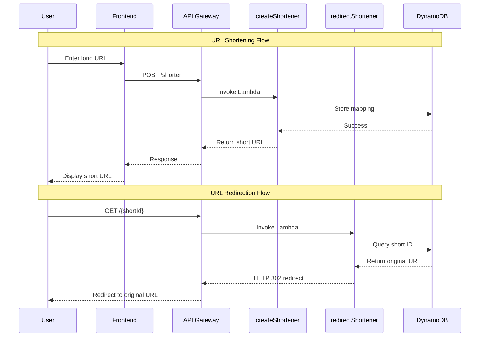

# 🏗️ Architecture Diagram

## System Overview

```mermaid
graph TB
    subgraph "Client Layer"
        A[Web Browser] --> B[Frontend Interface]
        C[Mobile App] --> D[API Client]
    end
    
    subgraph "CDN Layer"
        E[CloudFront Distribution]
    end
    
    subgraph "API Layer"
        F[API Gateway]
        G[/shorten - POST]
        H[/{shortId} - GET]
    end
    
    subgraph "Compute Layer"
        I[Lambda: createShortener]
        J[Lambda: redirectShortener]
    end
    
    subgraph "Data Layer"
        K[DynamoDB Table]
        L[urlTable]
    end
    
    subgraph "Infrastructure"
        M[Terraform]
        N[IAM Roles]
        O[CloudWatch Logs]
    end
    
    A --> E
    B --> E
    C --> F
    D --> F
    E --> F
    F --> G
    F --> H
    G --> I
    H --> J
    I --> K
    J --> K
    K --> L
    M --> I
    M --> J
    M --> F
    M --> K
    I --> O
    J --> O
```

## Data Flow Sequence



## Component Details

### AWS Lambda Functions
- **createShortener**: Handles URL shortening requests
- **redirectShortener**: Manages URL redirection

### Amazon DynamoDB
- **Table**: urlTable
- **Partition Key**: shortId (String)
- **Attributes**: shortId, longUrl, createdAt

### Amazon API Gateway
- **REST API**: RESTful endpoints
- **CORS**: Cross-origin resource sharing
- **Integration**: Lambda proxy integration

### Amazon CloudFront
- **Distribution**: Global CDN
- **Origin**: API Gateway
- **Caching**: Optimized for API responses

### Terraform Infrastructure
- **Provider**: AWS
- **Resources**: Lambda, API Gateway, DynamoDB, CloudFront
- **State**: Remote state management
