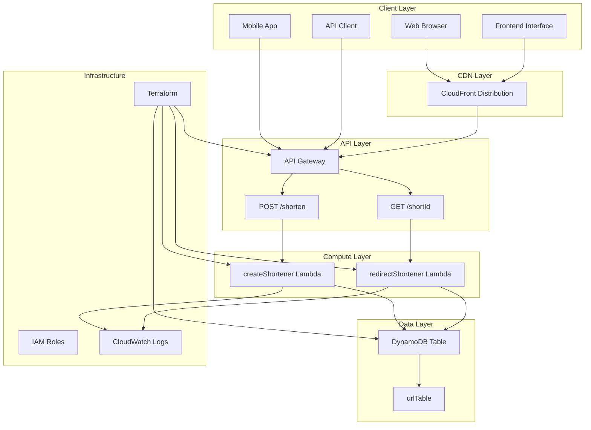
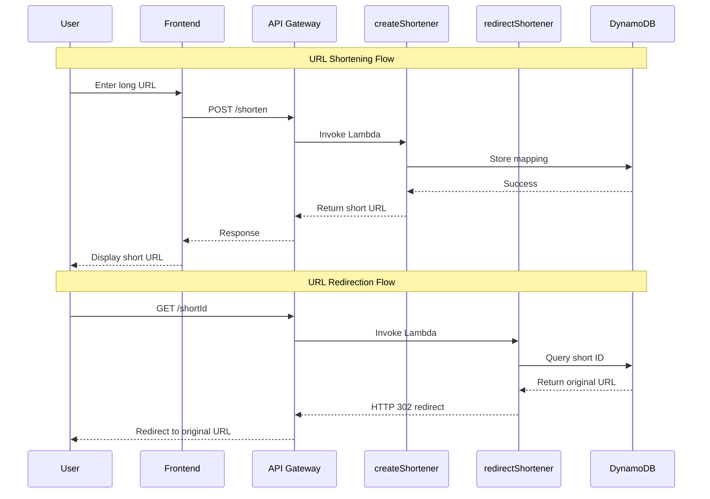

# 🔗 AWS Serverless URL Shortener

A fully functional, serverless URL shortener built with AWS Lambda, API Gateway, DynamoDB, and CloudFront. This project demonstrates modern serverless architecture patterns and provides a complete solution for shortening and redirecting URLs.


## 📋 Table of Contents

- [🚀 Features](#-features)
- [🏗️ Architecture](#️-architecture)
- [📊 System Diagram](#-system-diagram)
- [⚙️ How It Works](#️-how-it-works)
- [🛠️ Prerequisites](#️-prerequisites)
- [🚀 Quick Start](#-quick-start)
- [📁 Project Structure](#-project-structure)
- [🔧 Configuration](#-configuration)
- [🌐 API Endpoints](#-api-endpoints)
- [💻 Frontend Interface](#-frontend-interface)
- [📈 Monitoring & Logs](#-monitoring--logs)
- [🔒 Security Features](#-security-features)
- [💰 Cost Optimization](#-cost-optimization)
- [🤝 Contributing](#-contributing)
- [📄 License](#-license)

## 🚀 Features

- **🔗 URL Shortening**: Convert long URLs into short, manageable links
- **↩️ URL Redirection**: Seamless redirection from short URLs to original URLs
- **🌐 Web Interface**: Beautiful, responsive frontend for easy URL management
- **📊 Analytics**: Track URL usage and statistics
- **🔒 CORS Support**: Cross-origin resource sharing enabled
- **⚡ Serverless**: Fully serverless architecture with auto-scaling
- **💰 Cost-Effective**: Pay-per-use pricing model
- **🌍 Global CDN**: CloudFront distribution for fast global access
- **📱 Mobile Friendly**: Responsive design works on all devices

## 🏗️ Architecture

This project implements a modern serverless architecture using AWS services:

### **Core Components:**

1. **AWS Lambda Functions**
   - `createShortener`: Handles URL shortening requests
   - `redirectShortener`: Manages URL redirection

2. **Amazon DynamoDB**
   - Stores short URL mappings
   - Pay-per-request billing model
   - Automatic scaling

3. **Amazon API Gateway**
   - RESTful API endpoints
   - CORS configuration
   - Request/response transformation

4. **Amazon CloudFront**
   - Global CDN distribution
   - Caching for improved performance
   - Custom error handling

5. **Terraform Infrastructure**
   - Infrastructure as Code (IaC)
   - Automated deployment
   - Environment management

## 📊 System Diagram



## ⚙️ How It Works

### **URL Shortening Process:**

1. **User Input**: User enters a long URL in the frontend interface
2. **API Request**: Frontend sends POST request to `/shorten` endpoint
3. **Lambda Processing**: `createShortener` function:
   - Generates a unique 6-character short ID
   - Stores mapping in DynamoDB
   - Returns short URL to client
4. **Response**: Frontend displays the generated short URL

### **URL Redirection Process:**

1. **Short URL Access**: User clicks on a short URL
2. **API Request**: Browser sends GET request to `/{shortId}` endpoint
3. **Lambda Processing**: `redirectShortener` function:
   - Looks up short ID in DynamoDB
   - Retrieves original URL
   - Returns HTTP 302 redirect response
4. **Redirect**: Browser automatically redirects to original URL

### **Data Flow:**



## 🛠️ Prerequisites

Before deploying this project, ensure you have:

- **AWS Account** with appropriate permissions
- **Terraform** (v1.0+) installed
- **AWS CLI** configured with credentials
- **Python** (3.9+) for Lambda functions
- **Git** for version control

### **AWS Permissions Required:**
- Lambda (create, update, invoke functions)
- API Gateway (create, deploy APIs)
- DynamoDB (create, read, write tables)
- CloudFront (create distributions)
- IAM (create roles and policies)
- CloudWatch (logs and monitoring)

## 🚀 Quick Start

### **1. Clone the Repository**
```bash
git clone https://github.com/sahil5206/AWS-Serverless-URL-Shortener.git
cd AWS-Serverless-URL-Shortener
```

### **2. Configure AWS Credentials**
```bash
aws configure
# Enter your AWS Access Key ID
# Enter your AWS Secret Access Key
# Enter your default region (e.g., ap-south-1)
```

### **3. Deploy Infrastructure**
```bash
# Initialize Terraform
terraform init

# Review the deployment plan
terraform plan

# Deploy the infrastructure
terraform apply
```

### **4. Access the Application**
```bash
# Get the API Gateway URL
terraform output api_gateway_invoke_url

# Open the frontend
# Navigate to: http://localhost:8000/url-shortener-enhanced.html
# (Start local server: python -m http.server 8000)
```

## 📁 Project Structure

```
AWS-Serverless-URL-Shortener/
├── 📁 lambda_create/           # URL creation Lambda function
│   └── main.py                 # Lambda handler for shortening URLs
├── 📁 lambda_redirect/         # URL redirection Lambda function
│   └── main.py                 # Lambda handler for redirecting URLs
├── 📄 main.tf                  # Main Terraform configuration
├── 📄 variables.tf             # Terraform variables
├── 📄 outputs.tf               # Terraform outputs
├── 📄 url-shortener-enhanced.html  # Frontend interface
├── 📄 .gitignore               # Git ignore rules
├── 📄 README.md                # Project documentation
└── 📄 LICENSE                  # MIT License
```

## 🔧 Configuration

### **Environment Variables**
- `TABLE_NAME`: DynamoDB table name (default: "urlTable")
- `AWS_REGION`: AWS region (default: "ap-south-1")

### **Terraform Variables**
```hcl
variable "aws_region" {
  description = "AWS region to deploy resources"
  type        = string
  default     = "ap-south-1"
}

variable "project_name" {
  description = "Project name prefix for resource naming"
  type        = string
  default     = "serverless-url-shortener"
}
```

## 🌐 API Endpoints

### **Create Short URL**
```http
POST /shorten
Content-Type: application/json

{
  "longUrl": "https://example.com"
}
```

**Response:**
```json
{
  "shortId": "abc123",
  "shortUrl": "https://api-gateway-url/dev/abc123"
}
```

### **Redirect to Original URL**
```http
GET /{shortId}
```

**Response:**
```http
HTTP/1.1 302 Found
Location: https://original-url.com
```

## 💻 Frontend Interface

The project includes a beautiful, responsive web interface with:

- **🎨 Modern UI**: Clean, professional design
- **📱 Responsive**: Works on desktop, tablet, and mobile
- **💾 Local Storage**: Saves your shortened URLs locally
- **📊 Statistics**: Track usage and performance
- **🔧 Management**: Copy, test, and delete URLs
- **⚡ Real-time**: Instant feedback and updates

### **Features:**
- URL input validation
- Copy to clipboard functionality
- Test URL redirection
- Delete unwanted URLs
- Usage statistics tracking
- Error handling and user feedback

## 📈 Monitoring & Logs

### **CloudWatch Integration**
- **Lambda Logs**: Automatic logging for all function executions
- **API Gateway Logs**: Request/response logging
- **Error Tracking**: Detailed error messages and stack traces
- **Performance Metrics**: Execution time and memory usage

### **Monitoring Dashboard**
Access CloudWatch console to view:
- Function invocations and errors
- API Gateway request metrics
- DynamoDB read/write capacity
- CloudFront cache hit rates

## 🔒 Security Features

- **🔐 IAM Roles**: Least privilege access for all services
- **🌐 CORS Configuration**: Secure cross-origin requests
- **🛡️ Input Validation**: URL format and length validation
- **🔒 HTTPS Only**: All communications encrypted
- **📝 Audit Logging**: Complete request/response logging

## 💰 Cost Optimization

This serverless architecture provides excellent cost optimization:

- **💸 Pay-per-Use**: Only pay for actual usage
- **📊 DynamoDB On-Demand**: No provisioned capacity needed
- **⚡ Lambda**: 1M free requests per month
- **🌐 CloudFront**: Global CDN with competitive pricing
- **📈 Auto-Scaling**: Automatically scales with demand

### **Estimated Monthly Costs (1000 URLs/day):**
- Lambda: ~$0.20
- DynamoDB: ~$0.25
- API Gateway: ~$0.35
- CloudFront: ~$0.10
- **Total: ~$0.90/month**

## 🚀 Deployment Options

### **Option 1: Terraform (Recommended)**
```bash
terraform apply
```

### **Option 2: AWS Console**
Deploy each component manually through AWS console

### **Option 3: AWS CDK**
Convert Terraform configuration to AWS CDK

## 🧪 Testing

### **Unit Tests**
```bash
# Test Lambda functions locally
python test_lambda.py
```

### **Integration Tests**
```bash
# Test API endpoints
curl -X POST https://your-api-gateway-url/dev/shorten \
  -H "Content-Type: application/json" \
  -d '{"longUrl":"https://example.com"}'
```

## 🤝 Contributing

We welcome contributions! Please follow these steps:

1. **Fork** the repository
2. **Create** a feature branch (`git checkout -b feature/amazing-feature`)
3. **Commit** your changes (`git commit -m 'Add amazing feature'`)
4. **Push** to the branch (`git push origin feature/amazing-feature`)
5. **Open** a Pull Request

### **Development Guidelines:**
- Follow PEP 8 for Python code
- Add tests for new features
- Update documentation
- Use meaningful commit messages

## 📄 License

This project is licensed under the MIT License - see the [LICENSE](LICENSE) file for details.

## 🙏 Acknowledgments

- **AWS** for providing excellent serverless services
- **Terraform** for infrastructure as code capabilities
- **Open Source Community** for inspiration and tools

## 📞 Support

If you encounter any issues or have questions:

1. **Check** the [Issues](https://github.com/sahil5206/AWS-Serverless-URL-Shortener/issues) page
2. **Create** a new issue with detailed information
3. **Contact** the maintainer

---

<div align="center">

**⭐ Star this repository if you found it helpful!**

Made with ❤️ by [Sahil](https://github.com/sahil5206)

</div>